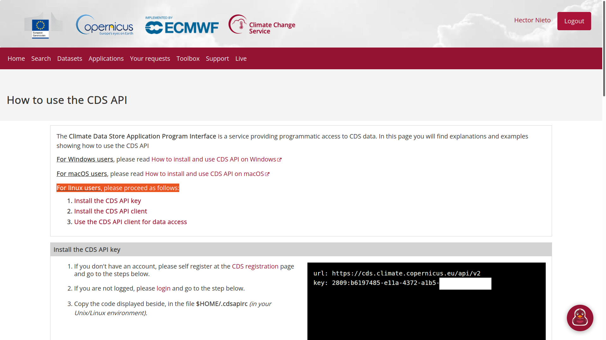

# QGIS ET PROCESSOR
This QGIS plugin allows the input data preparation for ET models as well as running TSEB with those and/or other inputs.

# Installation

## Registration at the Copernicus climate and atmoshperic data stores
This plugin allows the automatic download and preprocessing of ERA5 meteorological data, provided by ECMWF.
In order to properly work you should first register to the Copernicus' [Climate Data Store](https://cds.climate.copernicus.eu/user/register)
and [Atmospheric Data Store](https://ads.atmosphere.copernicus.eu/user/register) systems.
Once registered, follow the next steps to configure the credentials for the QGIS ET processor:

1. Go to your *HOME* or *user* folder. 
  > In Linux/MacOS this folder is at `/home/your_user_name`. In windows it is usually at `C:\Users\your_user_name`.

2. Login to Sthe [Climate Data Store](https://cds.climate.copernicus.eu/user/login?) with your username and password, 
then type the next URL address [https://cds.climate.copernicus.eu/api-how-to/#install-the-cds-api-key](https://cds.climate.copernicus.eu/api-how-to/#install-the-cds-api-key)

3. Create a blank ASCII file in your *HOME* folder named `.cdsapirc` (please note the dot `.` at the beginning of the string),
and paste the two lines that appear in the black box of the webpage.



  > These two lines have the following format:
  ```
  url: https://cds.climate.copernicus.eu/api/v2
  key: UID:API-KEY
  ```
  where *UID* and *API-KEY* are your Copernicus Climate Data Store credentials.

4. Login to the [Atmospheric Data Store](https://ads.atmosphere.copernicus.eu/user/login?) with your username and password, 
then type the next URL address [https://ads.atmosphere.copernicus.eu/api-how-to/#install-the-cds-api-key](https://ads.atmosphere.copernicus.eu/api-how-to/#install-the-cds-api-key)

5. Create a blank ASCII file in your *HOME* folder named `.adsapirc` (please note the dot `.` at the beginning of the string),
and paste the two lines that appear in the black box of the webpage.

  > These two lines have the following format:
  ```
   url: https://ads.atmosphere.copernicus.eu/api/v2
   key: UID:API-KEY
  ```
  where *UID* and *API-KEY* are your Copernicus Atmospheric Climate Data Store credentials.

## Installation of Requirements
This plugin requires a set of external libraries that we must be installed previously. 
These requirements are typed in the **requirements.txt** file. 
In order to easily install the required Python libraries, follow the next instructions depending on your Operative System:

### Windows
1. Run *OSGeoW Shell* from the QGIS shortcut links. A MS-DOS terminal should appear.
 
2. Browse to the folder where **requirements.txt** is located, which should be together with the subfolder **libraries**. To do so, make use of the comand `cd path\to\foder\`.
 
3. Type the following command `python -m pip install -r requirements.txt`.
 
Python will then start downloading and installing all required libraries included in **requirements.txt**.

### Linux
1. Open a Terminal, e.g. you can type `CTRL+ALT+T`.
 
2. Browse to the folder where *requirements.txt* is located, which should be together with the subfolder *libraries*. To do so, make use of the comand `cd path\to\foder\`.
 
3. Type the following command `/usr/bin/python3 -m pip install -r requirements.txt`.
 
Python will then start downloading and installing all required libraries included in **requirements.txt**.

## Installation of QGIS-ET-MODELS
Once the required libraries were installed, close the Terminal and launch QGIS.

1. Click on `Plugins` and then on `Manage and Install Plugins`.
 
2. Click on the option `Install from ZIP`.
 


3. Browse to the file **qgis-et-models.zip**, click on it and then click on `Install Plugin`.

It might take a while, but at the end you will see a message stating that the plugin has been installed.
The plugin should then appear in the Qgis `Processing Toolbox`, with the name **Evapotranspiration Processor**.


